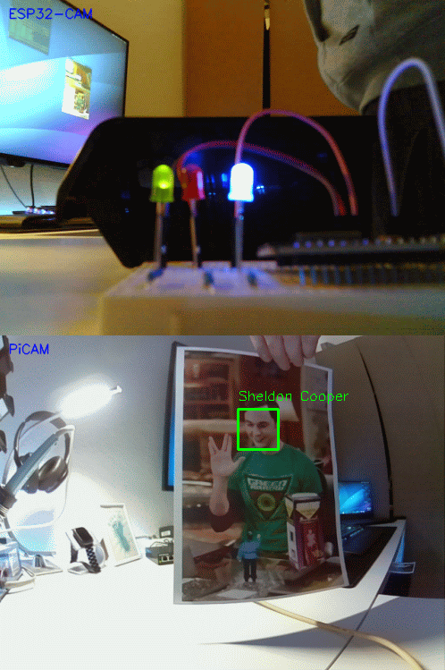

# EDU_OpenCV-Project

## Description
This is a project I realized in Raspberry Pi class which was part of my professional retraining. Since I have been using Raspberry Pi computers for years now, I wanted to do some more than just install a web server on it. As my trainer asked me to include some microcontrollers in my project, I decided to build a client-server application for face recognition. 
 
Goal of this project was to send the video stream of the cameras to the Pi 4, which processes the frames to recognize faces. If a face is detected, the Pi 4 should send a signal to the D1 mini, which indicates whether the face is known or not by lighting up a green or red LED.

### Devices and parts used:
- Raspberry Pi 4
- Raspberry Pi Zero W
- Raspberry Pi Camera
- ESP32-CAM Development Board
- D1 mini Development Board
- 3 LEDs and some jumper cables

### Software used:
- OpenCV
- dlib 
- ImageZMQ

### Demonstration

## Documentation
You can find my complete documentation in German language [here](https://github.com/faraway030/EDU_OpenCV-Project/blob/master/doc/EDU_OpenCV-Project.pdf).

